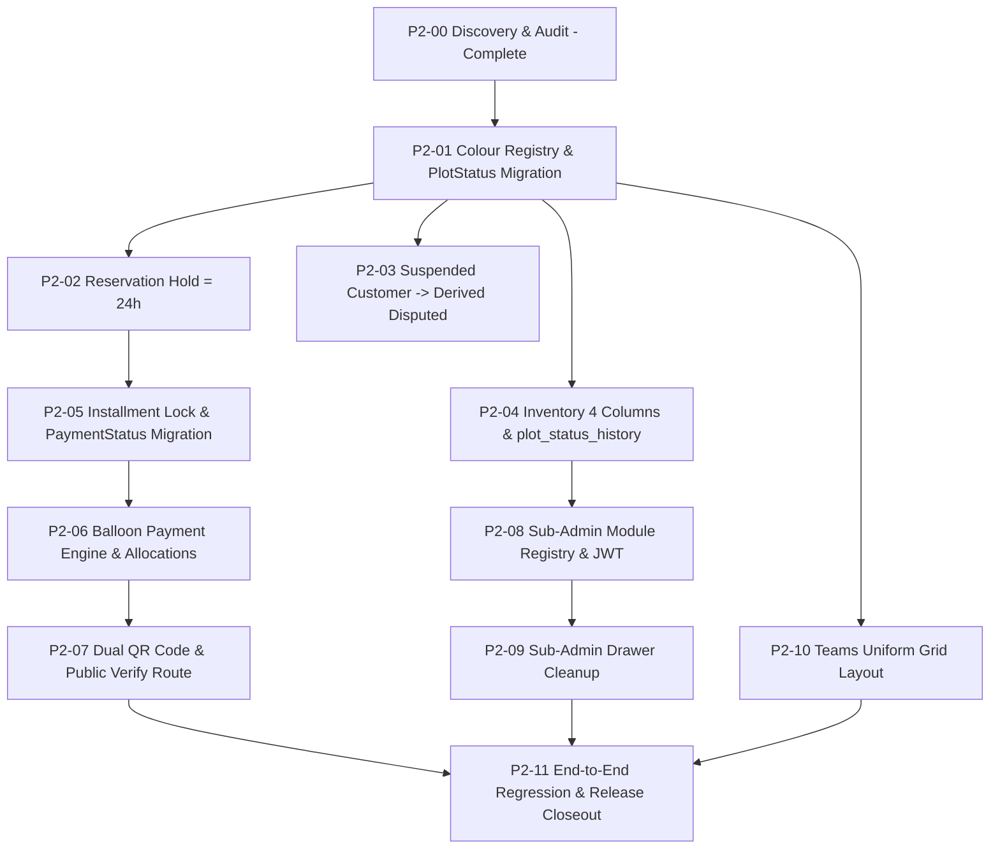

# PrimeView — Phase 2 Master Plan & Discovery Document (P2-00 AMENDED)

**Date:** September 22, 2026  
**Status:** P2-00 Discovery (Plan Mode Only — Zero code/schema/data modifications applied)  
**Authors/Roles:** Senior Full-Stack Engineering Agent & Systems Architect  

---

## 1. Verified Stack & Repository Architecture

### Frontend Repository
- **Disk Path:** `E:\Prime View\Prime View frontend`
- **Deployment:** Vercel (`https://prime-view-livid.vercel.app`)
- **Framework & Libraries:**
  - Next.js 15.5.24 (App Router)
  - React 19.0.0 / React DOM 19.0.0
  - Tailwind CSS 3.4.17
  - Lucide React 0.475.0, Framer Motion 13.1.1, Zustand 5.0.15
  - React Hook Form 7.87.0 + Zod 3.25.76

### Backend Repository
- **Disk Path:** `E:\Prime View\Prime view backend`
- **Deployment:** Render (`https://prime-view-backend.onrender.com`)
- **Framework & Libraries:**
  - NestJS 11.2.4 (Core, Common, Platform-Express)
  - Prisma ORM 5.22.0
  - PostgreSQL hosted on Supabase (with Row-Level Security in `prisma/rls.sql`, `rls_updates.sql`, `rls_phase2.sql`)
  - Passport JWT 4.0.1, Bcrypt 6.0.0, Class-Validator 0.15.1
  - Supabase-JS 2.116.0 (Realtime Broadcasts)

---

## 2. Seven Clarifications & Evidence (Amendments)

### 2.1. Decision D2 Reversion & Plot Allotment Rule
- **Approved Default:** **Allotted = full one-time payment only.**
- **Installment Plots Rule:** Plots purchased via installment plans remain `booked` even after the final installment is paid. There is **NO** auto-transition from `booked` to `allotted` upon installment completion.
- **Clarification:** Earlier assumption was based on general real estate deed issuance intuition; however, in PrimeView's domain model, installment plots stay `booked` indefinitely unless a separate administrative allotment workflow is explicitly commissioned. Phase 2 does not invent any such workflow.

### 2.2. Inventory "Available as of To" — Selection of Option A (`plot_status_history`)
To compute historical inventory accurately without guessing complex intervals across repeated reservations, releases, and cancellations:
- **Decision:** **Option A (Add `plot_status_history` table) is selected.**
- **Table Definition (to be created in P2-04):**
  ```sql
  CREATE TABLE IF NOT EXISTS "plot_status_history" (
    "id" UUID PRIMARY KEY DEFAULT gen_random_uuid(),
    "plotId" TEXT NOT NULL REFERENCES "Plot"("id") ON DELETE CASCADE,
    "fromStatus" "PlotStatus" NOT NULL,
    "toStatus" "PlotStatus" NOT NULL,
    "changedAt" TIMESTAMPTZ NOT NULL DEFAULT NOW(),
    "changedBy" TEXT NOT NULL,
    "reason" TEXT,
    "source" TEXT NOT NULL,
    "metadata" JSONB
  );

  CREATE INDEX IF NOT EXISTS "idx_plot_status_history_plot_time" ON "plot_status_history"("plotId", "changedAt");
  CREATE INDEX IF NOT EXISTS "idx_plot_status_history_to_status_time" ON "plot_status_history"("toStatus", "changedAt");
  ```
- **Central Mutation Helper:** Single `updatePlotStatus(tx, ...)` helper method in `plots.service.ts` invoked whenever plot status changes:
  1. `plots.service.ts` (`bookPlot`, `reservePlot`, `releaseReservation`, `toggleAdjustment`)
  2. `customers.service.ts` (`createCustomerWithBooking`)
  3. `sweep.service.ts` (`expireReservations`)
- **Historical Backfill Plan:**
  - Backfill 1: For all 15 existing `Booking` records, create history entries with `fromStatus: 'available'`, `toStatus: 'booked'` (or `'allotted'` for the 11 one-time bookings when migrated in P2-01), with `changedAt: booking.bookingDate`, `source: 'backfill_booking'`.
  - Backfill 2: For existing `Reservation` records, create entries with `toStatus: 'reserved'`, `changedAt: reservation.createdAt`. For expired/cancelled reservations, create subsequent entries with `toStatus: 'available'`.
  - Backfill 3: For all never-booked/never-reserved plots, record initial creation as `toStatus: 'available'`, `changedAt: plot.createdAt`.
- **Query Strategy for `From/To` Range:**
  - `Booked` in range = `COUNT(DISTINCT plotId)` in `plot_status_history` where `toStatus = 'booked'` AND `changedAt BETWEEN From AND To`.
  - `Allotted` in range = `COUNT(DISTINCT plotId)` where `toStatus = 'allotted'` AND `changedAt BETWEEN From AND To`.
  - `Reserved` in range = `COUNT(DISTINCT plotId)` where `toStatus = 'reserved'` AND `changedAt BETWEEN From AND To`.
  - `Available as of To` = Total sellable plots minus plots whose latest status before `To` was not `available`.

### 2.3. Full Sub-Admin Module Map (`AdminSidebar.tsx`)

| Route | Drawer Label | superAdminOnly? | requiresBlockAccess? | Permission Key / New Flag |
|---|---|---|---|---|
| `/admin/dashboard` | Admin Dashboard | No | No | `visible: true` (Base access for all admins) |
| `/admin/master-plan` | Master Plan (LOP) | No | **Yes** (hides if blocks = 0) | `NEEDS NEW FLAG: can_view_master_plan` |
| `/admin/inventory` | Inventory Overview | No | No | `NEEDS NEW FLAG: can_view_inventory` |
| `/admin/reservations` | Sort Reservations | No | **Yes** (scoped to blocks) | `can_reserve` |
| `/admin/customers-directory` | Customer Directory | No | No | `can_view_customers` |
| `/admin/customers` | Customer Bookings | No | **Yes** (scoped to blocks) | `can_create_customer` |
| `/admin/sales-history` | Sales History | No | No | `can_view_sales_history` |
| `/admin/receipts` | Receipt Verification | No | No | `can_verify_receipts` |
| `/admin/content` | Content CMS | No | No | `can_edit_content` |
| `/admin/sub-admins` | Sub-Administrators | **Yes** | No | Super Admin Only (Non-grantable) |
| `/admin/audit-log` | System Audit Log | **Yes** | No | Super Admin Only (Non-grantable) |

### 2.4. Grep Audit: Hardcoded `role: 'super_admin'` in `withScopedSession`

Grep query: `rg "role: 'super_admin'"` in `E:\Prime View\Prime view backend\src`  
Total occurrences: **29 calls across 7 files**.

| File:Line | Enclosing Function | Current Issue | Phase 2 Slice to Fix |
|---|---|---|---|
| `src/plots/plots.service.ts:44` | `getPlotWithScopeCheck` | Hardcoded bypass for plot check | **P2-01** (pass caller `session`) |
| `src/plots/plots.service.ts:808` | `toggleAdjustment` | Hardcoded bypass for plot lookup | **P2-01** (pass caller `session`) |
| `src/customers/customers.service.ts:37` | `createCustomerWithBooking` | Hardcoded bypass for plot check | **P2-01** (pass caller `session`) |
| `src/customers/customers.service.ts:1248` | `toggleSuspension` | Hardcoded bypass for customer lookup | **P2-03** (pass caller `session`) |
| `src/sweep/sweep.service.ts:80` | `runSweep` | Daemon sweep uses hardcoded bypass | **P2-02** (use system daemon session) |
| `src/reservations/reservations.service.ts:22` | `getReservations` | Hardcoded bypass for reservation fetch | **P2-02** (pass caller `session`) |
| `src/receipts/receipts.service.ts:39` | `submitPaymentReceipt` | Hardcoded bypass for customer lookup | **P2-05** (pass member `session`) |
| `src/receipts/receipts.service.ts:74` | `submitPaymentReceipt` | Hardcoded bypass for booking lookup | **P2-05** (pass member `session`) |
| `src/receipts/receipts.service.ts:344` | `verifyReceipt` | Hardcoded bypass for receipt fetch | **P2-06** (pass admin `session`) |
| `src/receipts/receipts.service.ts:466` | `rejectReceipt` | Hardcoded bypass for receipt fetch | **P2-06** (pass admin `session`) |
| `src/receipts/receipts.service.ts:584` | `verifySlipPublic` | Public endpoint spoofing super_admin | **P2-07** (use anon/public session) |
| `src/customers/customers.service.ts:206` | `createCustomerWithBooking` | Duplicate check spoofing super_admin | **P2-08** (pass admin `session`) |
| `src/customers/customers.service.ts:383` | `createCustomer` | Duplicate check | **P2-08** (pass admin `session`) |
| `src/customers/customers.service.ts:402` | `createCustomer` | Membership check | **P2-08** (pass admin `session`) |
| `src/customers/customers.service.ts:667` | `updateCustomer` | Customer update | **P2-08** (pass admin `session`) |
| `src/customers/customers.service.ts:942` | `issueCredentials` | Customer lookup | **P2-08** (pass admin `session`) |
| `src/customers/customers.service.ts:1171` | `assignStrike` | Customer lookup | **P2-08** (pass admin `session`) |
| `src/customers/customers.service.ts:1306` | `getCustomerProfile` | Customer fetch | **P2-08** (pass caller `session`) |
| `src/customers/customers.service.ts:1390` | `uploadCustomerDocument` | Customer fetch | **P2-08** (pass admin `session`) |
| `src/customers/customers.service.ts:1451` | `deleteCustomerDocument` | Document fetch | **P2-08** (pass admin `session`) |
| `src/admin/admin.service.ts:106` | `createSubAdmin` | Admin check | **P2-08** (pass super-admin `session`) |
| `src/admin/admin.service.ts:220` | `updateSubAdmin` | Admin fetch | **P2-08** (pass super-admin `session`) |
| `src/content/content.service.ts:33, 50, 86, 100, 165, 227, 389` | Content methods | Content CMS bypasses | **P2-08** (pass caller `session`) |
| `src/auth/auth.service.ts:17, 40, 52, 75, 101, 113` | `adminLogin`, `memberLogin` | Pre-auth credential validation before JWT exists | **P2-08** (convert to explicit `{ role: 'auth_service' }`) |

### 2.5. One-Time → Allotted Read-Only Dry-Run Output
- **Read-Only Prisma Query Executed Against Supabase Database:**
  ```typescript
  const oneTimeBookedCount = await tx.booking.count({
    where: {
      paymentType: 'one_time',
      plot: {
        status: 'booked',
      },
    },
  });
  ```
- **Real Database Counts:**
  - `totalPlots`: **233**
  - `totalBookings`: **15**
  - `oneTimeBookedCount`: **11**
- **Specific Plots & Bookings Identified:**
  1. `plot-a-01` (A-01, Abbott) — Booking `book-1789346207463-c7bj` (Customer `cust-1789346204862-qzlx`) & `book-1789346204123-dlee`
  2. `plot-a-02` (A-02, Abbott) — Booking `book-1789347358889-r9hb` (Customer `cust-1`)
  3. `plot-a-03` (A-03, Abbott) — Booking `book-1789348482225-ooy7` (Customer `cust-1789346204862-qzlx`)
  4. `plot-a-04` (A-04, Abbott) — Booking `book-1789348786485-a5rv` (Customer `cust-1789346204862-qzlx`)
  5. `plot-a-05` (A-05, Abbott) — Booking `book-1789350468413-o1f4` (Customer `cust-1`)
  6. `plot-a-12` (A-12, Abbott) — Booking `book-1` (Customer `cust-1`)
  7. `plot-c-09` (C-09, Overseas) — Booking `book-4` (Customer `cust-3`)
  8. `plot-ch-02` (CH-02, Chalet) — Booking `book-1789384092415-c5u7` (Customer `cust-1789346204862-qzlx`)
  9. `plot-ov-03` (OV-03, Overseas) — Booking `book-1789388399411-r4g6` (Customer `cust-1789346204862-qzlx`)
  10. `plot-ov-04` (OV-04, Overseas) — Booking `book-1789388467213-hamp` (Customer `cust-1789346204862-qzlx`)

### 2.6. Existing QR Payload in `OfficialA4PaymentSlip.tsx`
- **File Reference:** `E:\Prime View\Prime View frontend\src\components\receipts\OfficialA4PaymentSlip.tsx`
- **Model Payload Generator (`line 64`):**
  ```typescript
  qrPayload: sub.slip?.qrPayload || `PRIME-VIEW|${sub.membershipNo}|${sub.plotNumber}|${sub.amount}`,
  ```
- **Actual Rendered QR Code in Lower Part (`lines 391–397`):**
  ```tsx
   {
      // Fallback if network fails
      (e.currentTarget as HTMLElement).style.display = 'none';
    }}
  />
  ```
- **Upper Part Status:** Currently contains **NO** QR code image (text and hash only).
- **P2-07 Requirement:** Unify both halves to encode `${origin}/verify/${slip.slipNumber}` with standard sizing and error correction.

### 2.7. SQL Nits & Type Source of Truth
- **Foreign Key Constraint:** Standardized to `ON DELETE RESTRICT` (PostgreSQL standard):
  ```sql
  "paymentRecordId" TEXT NOT NULL REFERENCES "PaymentRecord"("id") ON DELETE RESTRICT
  ```
- **`PlotStatus` Source of Truth:** `E:\Prime View\Prime view backend\prisma\schema.prisma:30-34` (`enum PlotStatus`). Frontend types in `src/lib/mock/types.ts` are deprecated prototype artifacts and will never be treated as the system source of truth.

---

## 3. Slice Build Order & Execution Plan



- **P2-00:** Discovery & System Verification (Complete with this amended document).
- **P2-01:** Map colour tokens, SVG hatch pattern, legend note, pill, `PlotStatus` migration (`allotted`, `disputed`), one-time booking status rule (11 plots migrated).
- **P2-02:** Reservation hold default = 24h in `plots.service.ts` and frontend dialog.
- **P2-03:** Derived `Disputed` status for plots owned by suspended members on map view.
- **P2-04:** Inventory Overview: 4 columns (`Booked`, `Allotted`, `Reserved`, `Available`), `plot_status_history` table + backfill, server-side date range filter, print layout.
- **P2-05:** Server-computed next due installment lock, tamper protection, `partially_paid` status migration.
- **P2-06:** Balloon payment engine in pure integer PKR, `payment_allocations` table (`ON DELETE RESTRICT`), customer preview, admin verification with concurrency row-locks.
- **P2-07:** Dual QR codes on both parts of `OfficialA4PaymentSlip`, extended public verify endpoint.
- **P2-08:** Sub-admin drawer module registry, unified `AdminUser.permissions` JSON mapping, JWT verification.
- **P2-09:** Sub-admin dynamic drawer filtering by module grants and block assignments.
- **P2-10:** Teams section uniform responsive grid layout (4:5 photos, equal height cards).
- **P2-11:** Documentation sync, typecheck/build verification for both repos, live deployment checks, owner release notes.

---

## 4. Explicit "Will NOT Create" Forbidden List

1. ❌ **NO `installments` Table:** Installments are tracked exclusively via `PaymentRecord` (`feeType: 'plot_installment'`).
2. ❌ **NO `sub_admin_permissions` Table:** Sub-admin privileges are stored in `AdminUser.permissions` JSON and forwarded intact via JWT.
3. ❌ **NO Second Public Verify Route:** All verification utilizes the existing `/verify/[slipNumber]` page and `GET /receipts/verify/:slipNumber` API.
4. ❌ **NO JavaScript Floats for Ledger:** All financial calculations operate on integer rupees in memory and PostgreSQL `Decimal(14, 2)`.
5. ❌ **NO Hardcoded `{ role: 'super_admin' }` in `withScopedSession`:** All database transactions run under the caller's authentic session context.
